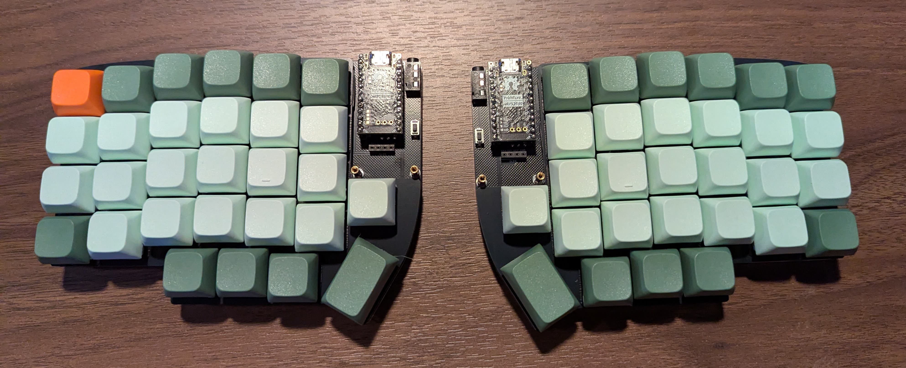

# RMK Lily58 Keyboard

Based on RMK and nrf52840, Lily58_Pro PCB (also called Pandakb or Minifuny).



## uf2 support

If you’re using the Adafruit_nRF52_Bootloader (pre-installed on the nice!nano), you’re in luck! This bootloader supports the .uf2 firmware format, which eliminates the need for a debugging probe to flash your firmware. RMK uses the `cargo-make` tool to generate .uf2 firmware, with the generation process defined in the `Makefile.toml`.

Follow these steps to generate and flash the .uf2 firmware with RMK:

1. Get `cargo-make` tool:
   ```shell
   cargo install --force cargo-make
   ```
2. Compile RMK and generates .uf2 firmware:
   ```shell
   cargo make uf2 --release
   ```
3. Flash

   - Put your board into bootloader mode. A USB drive will appear on your computer.
   - Drag and drop the generated .uf2 firmware file onto the USB drive. The RMK firmware will be automatically flashed onto your microcontroller.

   For additional details on entering bootloader mode and flashing firmware, refer to the [nice!nano documentation](https://nicekeyboards.com/docs/nice-nano/getting-started#flashing-firmware-and-bootloaders)

### Tips for nRF52840

For nRF52840, there are several widely used UF2 bootloaders, they require slight different configs.

First, you should check the used softdevice version of your bootloader. Enter bootloader mode, there will be an USB driver shown in your computer. Open `INFO_UF2.TXT` in the USB driver, the content of `INFO_UF2.TXT` should be like:

```
UF2 Bootloader 0.6.0 lib/nrfx (v2.0.0) lib/tinyusb (0.10.1-41-gdf0cda2d) lib/uf2 (remotes/origin/configupdate-9-gadbb8c7)
Model: nice!nano
Board-ID: nRF52840-nicenano
SoftDevice: S140 version 6.1.1
Date: Jun 19 2021
```

As you can see, the version of softdevice is `S140 version 6.1.1`. For nRF52840, RMK supports S140 version 6.X and 7.X. The `memory.x` config is slightly different for softdevice 6.X and 7.X:

```ld
MEMORY
{
  /* These values correspond to the NRF52840 with Softdevices S140 6.1.1 */
  /* FLASH : ORIGIN = 0x00026000, LENGTH = 824K */

  /* These values correspond to the NRF52840 with Softdevices S140 7.3.0 */
  FLASH : ORIGIN = 0x00027000, LENGTH = 820K
  RAM : ORIGIN = 0x20020000, LENGTH = 128K
}
```

You can edit your `memory.x` to choose correct value for your bootloader.

### Additional notes

RMK defaults to USB-priority mode if a USB cable is connected. After flashing, remember to disconnect the USB cable, or [switch to BLE-priority mode](https://haobogu.github.io/rmk/wireless.html#multiple-profile-support) by pressing User11(Switch Output) key.

